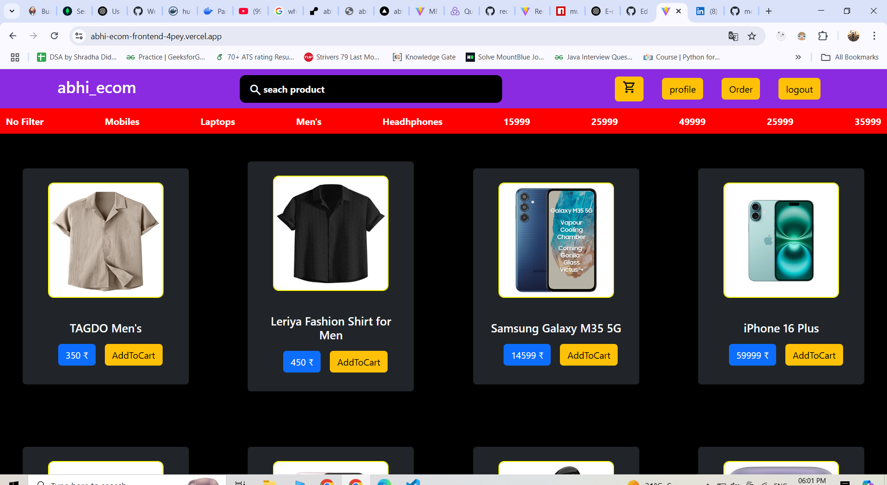
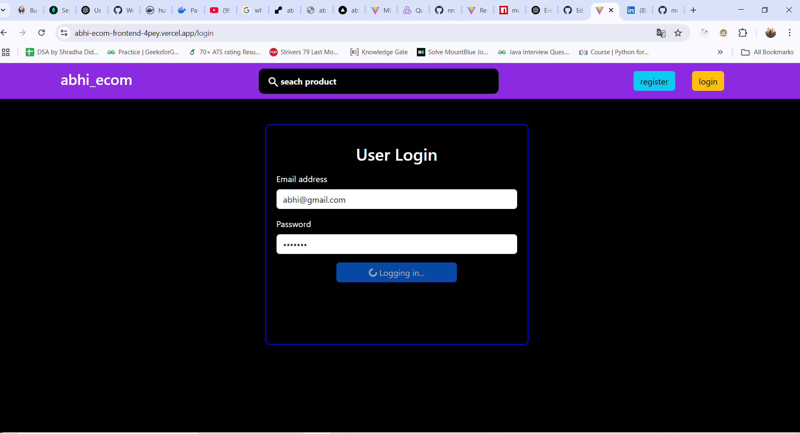
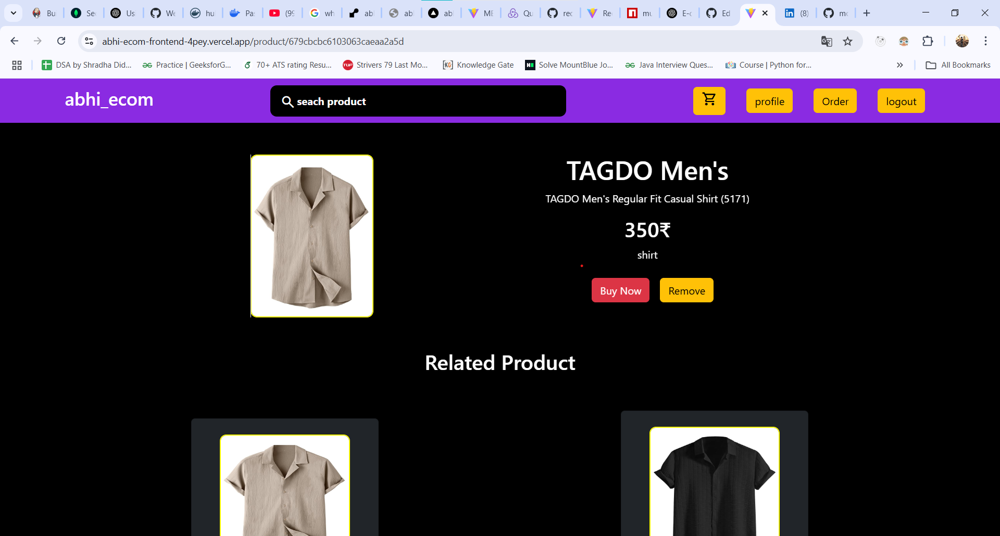
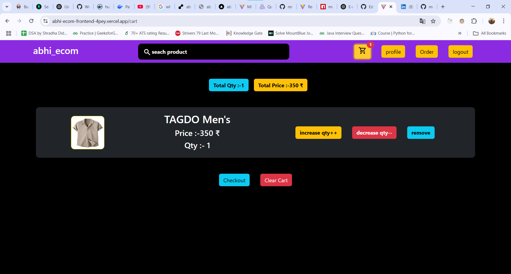
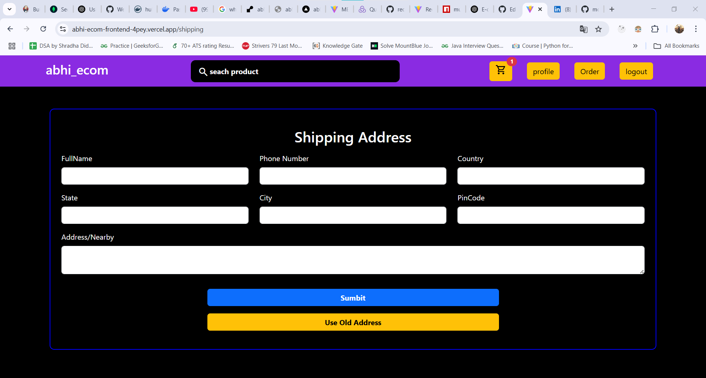
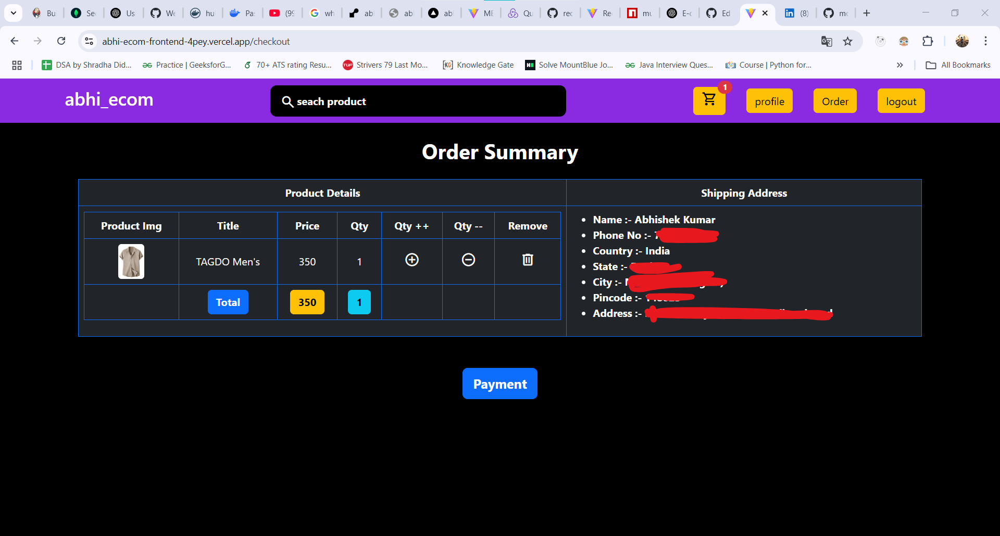
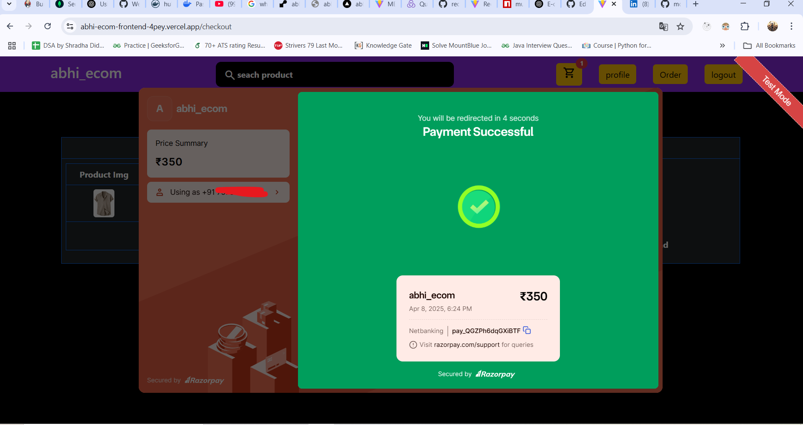
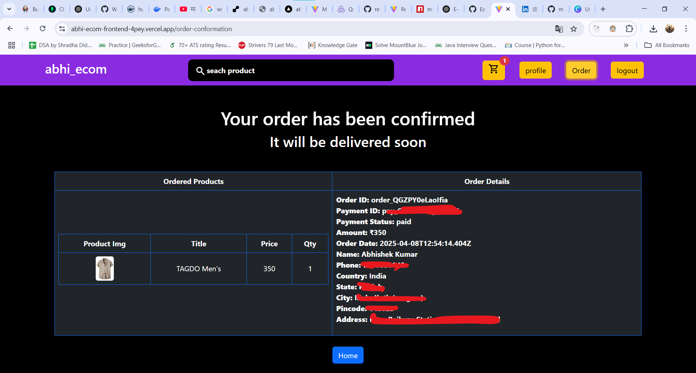

# 🛍️ abhi-ecom

An e-commerce web application built using the MERN stack, with features like user authentication, product browsing, cart management, and secure online payments via Razorpay.

## 🔧 Tech Stack

### 💻 Frontend:
- React.js
- Vite
- Bootstrap

### 🖥️ Backend:
- Node.js
- Express.js

### 🗃️ Database:
- MongoDB

### 🔐 Authentication:
- JWT (JSON Web Token)

### 💳 Payment Gateway:
- Razorpay

---

## 🚀 Features

✅ User Registration and Login  
✅ Add to Cart (increase or decrease the qty)
✅ Product Search 
✅ Checkout and Place Order  
✅ Razorpay Payment Integration  

---

## 🌐 Live Demo

👉 [Click here to view live demo](https://abhi-ecom-frontend-4pey.vercel.app/)

---
## 📸 Screenshots

> - Home Page  


> - Login  


> - Product Detail Page  


> - Cart  


> - Checkout  


> - Order Summary  


> - Payment Success Page  


> - Order Details  


---


## 📂 Project Setup

### Frontend

```bash
cd client
npm install
npm run dev

### backend (another reprositry name (abhi_ecom))
```bash
cd backend
npm install (you need to install some package eg:-express.js,jwt,cors or other)
node server.js

🔐 Environment Variables
Create a .env file in backend/ with the following:-
PORT=5000
MONGODB_URI=your_mongodb_connection_string
JWT_SECRET=your_jwt_secret
RAZORPAY_KEY_ID=your_key_id
RAZORPAY_KEY_SECRET=your_key_secret


## 🧑‍💼 Author

**Abhishek Kumar**

🔗 [Connect with me on LinkedIn](https://www.linkedin.com/in/abhishek-kumar193/)

